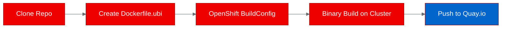
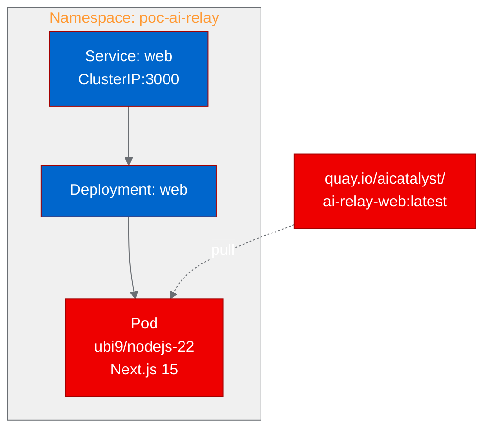

## What is AI Relay?

AI Relay is an open-source AI API gateway that sits between your applications and multiple LLM providers. Think of it as a reverse proxy for AI: your apps call one endpoint, and AI Relay handles provider selection, key rotation, failover, and protocol translation behind the scenes.

The project supports OpenAI, Anthropic (Claude), DeepSeek, MiMo, and any custom OpenAI-compatible API. It rotates API keys with automatic 429 backoff, implements circuit-breaker failover across providers, and routes requests by latency, cost, or availability. A built-in admin dashboard lets you manage keys, monitor usage, test models, and configure routing policies, all from a single web interface.

We wanted to find out if this kind of AI infrastructure middleware could run natively on Red Hat OpenShift using UBI-based containers.

## Why an LLM gateway matters for enterprise AI

Enterprise teams rarely use just one LLM provider. Production workloads might route high-priority requests to GPT-5.5, fall back to Claude for cost optimization, and use DeepSeek for batch processing. Without a gateway layer, each application needs its own provider logic, key management, and failover handling.

AI Relay solves this by providing a single OpenAI-compatible endpoint. Applications swap their `base_url` and get multi-provider routing, automatic failover, key rotation, and centralized usage tracking. For platform engineers running Red Hat OpenShift AI, this means one less integration problem per application team.

## Containerizing for OpenShift with UBI

AI Relay is a Next.js 15 application built with pnpm. It has no existing Dockerfile, so we created one from scratch using `registry.access.redhat.com/ubi9/nodejs-22` as the base image.

Three issues came up during containerization:

**npm registry override.** The project's `.npmrc` points to a Chinese npm mirror (`registry.npmmirror.com`). We overrode this in the Dockerfile to use the default npm registry, ensuring reproducible builds from any location.

**Next.js standalone output.** For production container deployments, Next.js should use `output: "standalone"` to create a self-contained server bundle. We patched `next.config.mjs` during the build to enable this, then copied the `public/` and `.next/static/` directories into the standalone output.

**File permissions.** UBI Node.js images run as UID 1001 by default. We switched to `USER 0` for build steps (installing pnpm, copying files, running `next build`) and then set group-0 permissions (`chgrp -R 0 /opt/app-root && chmod -R g=u /opt/app-root`) before switching back to `USER 1001` for the runtime. This ensures OpenShift's arbitrary UID assignment works correctly.

The build ran on-cluster using an OpenShift BuildConfig with binary input. The first attempt failed due to the `.npmrc` permission issue; the second succeeded and pushed the image to `quay.io/aicatalyst/ai-relay-web:latest`.

## Deploying to the cluster

The deployment uses a standard Kubernetes Deployment with a ClusterIP Service on port 3000. We kept the resource profile small: 256Mi memory request, 512Mi limit, 250m CPU request, 500m limit. AI Relay is a pure API proxy with no model inference, so it doesn't need GPU resources or large memory allocations.

One deployment detail worth noting: AI Relay's `/health` endpoint returns HTTP 503 when no LLM provider keys are configured. This is correct behavior (the app reports "degraded" status), but Kubernetes HTTP readiness probes treat anything outside 200-399 as a failure. We switched to TCP socket probes on port 3000, which verify the server is listening without caring about the HTTP response code.

The full deployment topology:

## Validating the deployment

We ran four test scenarios against the deployed service:

| Scenario | Endpoint | Result | Response Time |
|----------|----------|--------|---------------|
| Health check | `GET /health` | Pass (503 degraded) | 0.04s |
| Models listing | `GET /v1/models` | Pass (200) | 0.01s |
| Admin dashboard | `GET /admin` | Pass (200) | 0.01s |
| Homepage | `GET /` | Pass (200) | <0.01s |

The health endpoint returned a structured JSON response with version info, provider status (0 configured, 6 available), and feature flags. The models endpoint returned a full catalog of supported models across all providers, including pricing and capability metadata, even without configured API keys.

The admin dashboard loaded with all its React components, CSS, and JavaScript bundles. This is the page where operators would manage API keys, configure routing policies, and monitor usage in a production deployment.

## What we learned

**Next.js standalone mode is essential for containers.** Without `output: "standalone"`, the production server requires the entire `node_modules` tree at runtime, bloating the image and slowing startup. Standalone mode bundles everything needed into a single directory with a self-contained `server.js`.

**Health endpoints need probe-aware design.** Returning 503 for "degraded but functional" status is semantically correct, but it breaks Kubernetes HTTP probes. Applications deployed on OpenShift should either return 200 for any "running" state or document that TCP probes are needed.

**Chinese npm mirrors in `.npmrc` can break CI/CD.** If a project hardcodes a regional mirror, container builds in other regions may fail or produce different dependency trees. Overriding `.npmrc` early in the Dockerfile is a reliable fix.

**OpenShift BuildConfig handles everything.** Binary builds (`oc start-build --from-dir`) upload local source and build on-cluster. No local container runtime (Docker, Podman) is needed. The build pushes directly to the external registry using a push secret.

## Try it yourself

The full deployment artifacts are available in the [autopoc-artifacts branch](https://github.com/aicatalyst-team/ai-relay/tree/autopoc-artifacts):

- `Dockerfile.ubi` for UBI-based containerization
- `kubernetes/` directory with Deployment and Service manifests
- `poc_test.py` for automated validation
- `poc-report.md` for the complete PoC report

To add actual LLM provider routing, create a Kubernetes Secret with your API keys and reference them in the Deployment's environment variables. AI Relay's admin dashboard provides a web interface for configuring providers once the keys are available.

The source project is at [github.com/MoyuFamily/ai-relay](https://github.com/MoyuFamily/ai-relay), and the AutoPoC fork is at [github.com/aicatalyst-team/ai-relay](https://github.com/aicatalyst-team/ai-relay).
