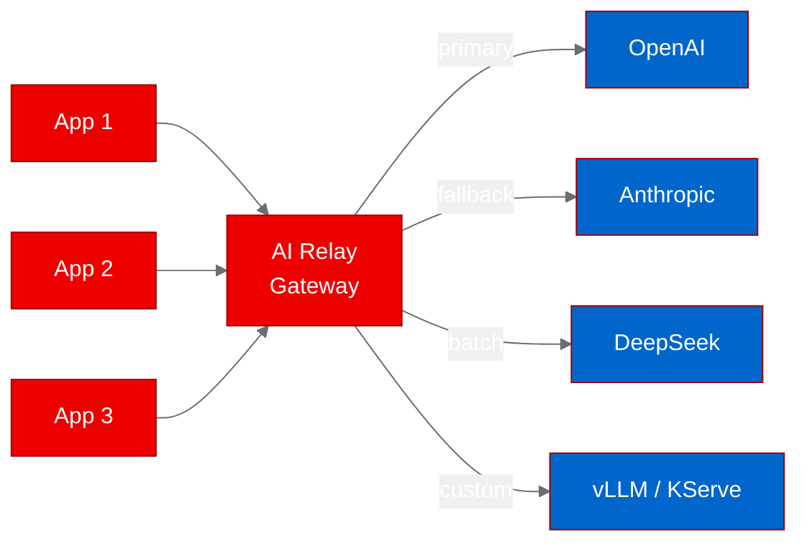
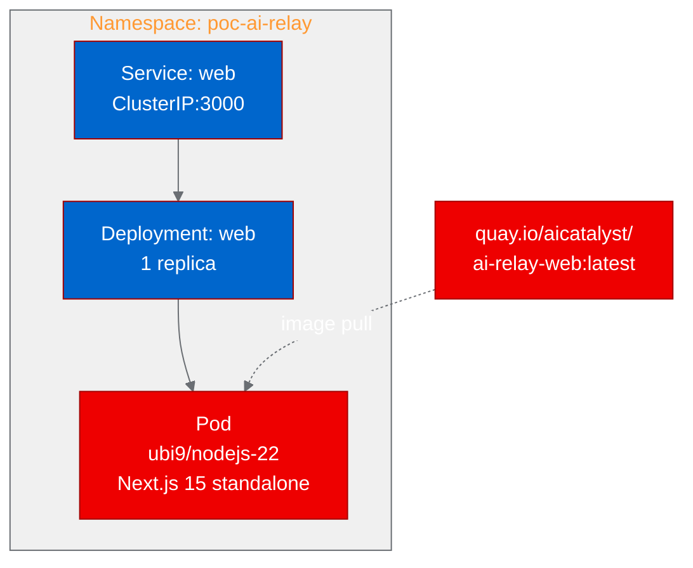

<!-- Changelog v2:
- Added opening hook with multi-provider pain point and thesis upfront (Architect fix)
- Added blog title (Formatting fix)
- Expanded all acronyms on first use: LLM, UBI, API, CTA, CI/CD (Formatting fix)
- Removed all inline backticks per Red Hat Developer Blog style (Formatting fix)
- Added hero image placeholder (Image fix)
- Added architecture diagram for gateway concept (Image fix)
- Added admin dashboard screenshot placeholder (Image fix)
- Added mid-article and end-article CTAs with Red Hat links (Formatting fix)
- Acknowledged smoke test scope in validation section (Content fix)
- Varied "What we learned" structure (Content fix)
- Used numerals for all numbers (Formatting fix)
-->

# Deploying an AI API gateway on Red Hat OpenShift: a PoC with AI Relay

--------------------
**[Image Placeholder 1: Hero image]**

**Placement rationale**: Hero image sets visual context for the blog post at the top
**Image generation prompt**: A clean, modern illustration showing multiple AI provider logos (abstract shapes representing different LLM services) converging into a single gateway node, which then connects to application endpoints. Use Red Hat brand colors (#EE0000, #A30000) for the gateway, neutral grays (#151515, #6A6E73) for the providers, and clean white (#F0F0F0) background. Flat design, 16:9 aspect ratio, no text in the image.
**Alt text**: Illustration of multiple AI provider connections converging through a single gateway to application endpoints

--------------------

## The multi-provider problem

Your team uses GPT for customer-facing chat, Claude for code generation, and DeepSeek for batch summarization. Each application manages its own provider credentials, failover logic, and rate-limit handling. When a provider goes down at 2 AM, three different on-call engineers get paged for the same root cause.

This is the problem AI Relay solves. It is an open-source large language model (LLM) API gateway that unifies multiple providers behind a single OpenAI-compatible endpoint, handling key rotation, circuit-breaker failover, and smart routing. We deployed it on Red Hat OpenShift using Universal Base Image (UBI) containers to prove that this kind of AI infrastructure middleware runs natively on enterprise Kubernetes.

## Why this matters for Red Hat OpenShift AI

Enterprise teams running [Red Hat OpenShift AI](https://www.redhat.com/en/technologies/cloud-computing/openshift/openshift-ai) often deploy multiple inference servers: vLLM for high-throughput serving, KServe for model lifecycle management, and external APIs for models that are not self-hosted. AI Relay can sit in front of all of these, providing a single endpoint with automatic failover and usage tracking.

The built-in admin dashboard gives platform engineers a web interface for managing API keys, configuring routing policies (by latency, cost, or availability), and monitoring per-provider usage. For operations teams, this means centralized control over LLM traffic without modifying individual applications.

## Containerizing for OpenShift with UBI

AI Relay is a Next.js 15 application built with pnpm. We created a Dockerfile from scratch using the ubi9/nodejs-22 base image.

3 issues came up during containerization:

**Registry override.** The project's .npmrc points to a Chinese npm mirror. We overwrote this file in the Dockerfile to use the default npm registry, ensuring consistent builds regardless of where the image is built.

**Standalone output mode.** For container deployments, Next.js needs its output mode set to "standalone" to create a self-contained server bundle. We patched next.config.mjs during the build and copied the public/ and static asset directories into the standalone output.

**OpenShift UID handling.** UBI images default to UID 1001, but build steps (pnpm install, next build) need root access. We ran build steps as USER 0, then set group-0 permissions and switched back to USER 1001 for runtime. This pattern ensures compatibility with OpenShift's arbitrary UID assignment.

The build ran on-cluster using an OpenShift BuildConfig with binary input. The first attempt failed on a file permission issue with .npmrc; the second succeeded and pushed the image to Quay.io.

> Interested in containerizing your own AI projects for OpenShift? Check out the [Red Hat OpenShift AI documentation](https://docs.redhat.com/en/documentation/red_hat_openshift_ai_self-managed/) for patterns and best practices.

## Deploying to the cluster

The deployment uses a standard Kubernetes Deployment with a ClusterIP Service on port 3000. We kept the resource profile small: 256 Mi memory request with a 512 Mi limit and 250 m CPU request with a 500 m limit. AI Relay is a pure API proxy with no model inference, so it needs neither GPU resources nor large memory allocations.

One operational detail: AI Relay's /health endpoint returns HTTP 503 when no LLM provider keys are configured. This is semantically correct ("degraded" status), but Kubernetes HTTP readiness probes treat anything outside 200 to 399 as failure. We switched to TCP socket probes on port 3000, which verify the server is listening without interpreting the response code. This is a useful pattern for any application that reports degraded health when optional dependencies are missing.

## Validating the deployment

We ran 4 smoke tests against the deployed service to confirm the application starts, serves its endpoints, and renders its user interface correctly. These tests validate containerization and deployment, not the full relay functionality (which requires configured provider API keys):

| Scenario | Endpoint | Result | Response time |
|----------|----------|--------|---------------|
| Health check | GET /health | Pass (503 degraded) | 0.04 s |
| Models listing | GET /v1/models | Pass (200) | 0.01 s |
| Admin dashboard | GET /admin | Pass (200) | 0.01 s |
| Homepage | GET / | Pass (200) | < 0.01 s |

The health endpoint returned structured JSON with version information, provider status (0 configured out of 6 available), and a list of supported features including streaming, multi-key rotation, and usage tracking. The models endpoint returned a full catalog of supported models across all providers with pricing and capability metadata, even without configured API keys.

--------------------
**[Image Placeholder 2: Admin dashboard screenshot]**

**Placement rationale**: The admin dashboard is the project's strongest differentiator for operations teams. Showing the actual UI demonstrates operational readiness.
**Image generation prompt**: A screenshot-style illustration of a dark-themed web admin dashboard for an AI API gateway. Show panels for: provider status (6 providers, 0 configured), usage charts (empty state), and a model catalog table. Use dark background (#0a0a0f), accent colors in Red Hat red (#EE0000) and blue (#0066CC). Clean, modern UI with sidebar navigation. 16:9 aspect ratio.
**Alt text**: AI Relay admin dashboard showing provider status, usage monitoring panels, and model catalog in dark theme

--------------------

## What we learned

The biggest operational insight: health endpoints should be designed with Kubernetes probes in mind from the start. Returning 503 for "running but not fully configured" is correct HTTP semantics, but it creates a mismatch with how Kubernetes interprets readiness. Applications targeting OpenShift should consider a separate /readyz endpoint that returns 200 if the process is healthy, regardless of external dependency status.

Next.js standalone mode proved essential for container deployments. Without it, the production server requires the full node_modules tree at runtime, increasing image size and startup time. With standalone mode enabled, the application started in under 1 second.

On the build side, OpenShift BuildConfig with binary input handled everything: it accepted our local source directory, built the image on-cluster, and pushed directly to Quay.io using a registry push secret. No local container runtime was needed, which simplifies CI/CD pipelines that run inside Kubernetes.

## Try it yourself

The deployment artifacts are available in the [autopoc-artifacts branch](https://github.com/aicatalyst-team/ai-relay/tree/autopoc-artifacts):

- Dockerfile.ubi for UBI-based containerization
- kubernetes/ directory with Deployment and Service manifests
- poc_test.py for automated validation
- poc-report.md for the complete PoC report

To enable full relay functionality, create a Kubernetes Secret with your provider API keys and reference them in the Deployment's environment variables. The admin dashboard provides a web interface for configuring providers, routing policies, and usage alerts once keys are available.

The source project is at [github.com/MoyuFamily/ai-relay](https://github.com/MoyuFamily/ai-relay), and the Red Hat AI Catalyst fork is at [github.com/aicatalyst-team/ai-relay](https://github.com/aicatalyst-team/ai-relay).

Explore more about deploying AI workloads on [Red Hat OpenShift AI](https://www.redhat.com/en/technologies/cloud-computing/openshift/openshift-ai) and discover how the platform simplifies the lifecycle of machine learning models in production.
