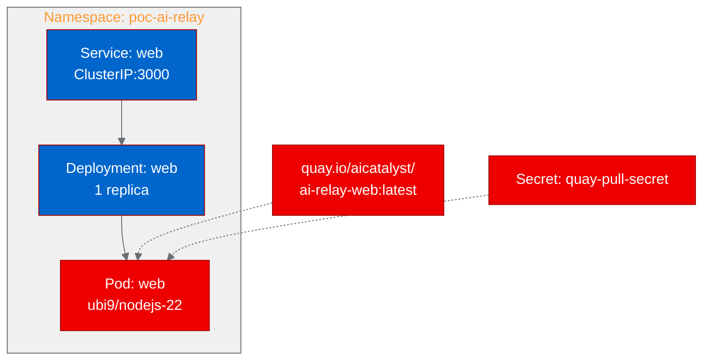

# PoC Report: ai-relay

## 1. Executive Summary

AI Relay, a personal AI API gateway that unifies multiple LLM providers behind a single OpenAI-compatible endpoint, was successfully containerized and deployed on OpenShift. All four test scenarios passed, validating the health endpoint, models API, admin dashboard, and homepage. The application runs in degraded mode without API keys, which is acceptable for infrastructure validation. The deployment demonstrates that Next.js-based AI middleware can operate on OpenShift with UBI-based containers.

## 2. Project Analysis

- **Repository:** [MoyuFamily/ai-relay](https://github.com/MoyuFamily/ai-relay)
- **Fork:** [aicatalyst-team/ai-relay](https://github.com/aicatalyst-team/ai-relay)
- **Description:** AI Relay is a serverless AI API relay gateway supporting multi-provider routing, key rotation, failover, protocol bridging (OpenAI/Anthropic), and an admin dashboard for monitoring and management.
- **Classification:** api-service

| Component | Language | Build System | ML Workload | Port |
|-----------|----------|-------------|-------------|------|
| web | TypeScript | pnpm (Next.js 15) | No | 3000 |

- **Key Technologies:** TypeScript, Next.js 15, React 19, pnpm, Drizzle ORM, Recharts
- **License:** MIT

## 3. PoC Objectives

1. Validate containerization of a Next.js AI gateway on OpenShift using UBI base images
2. Confirm API endpoints and admin dashboard accessibility through Kubernetes Services
3. Verify health monitoring endpoint for Kubernetes probes
4. Demonstrate the models listing API works without external provider configuration

**Relevance to OpenShift AI:** AI Relay serves as infrastructure middleware that can sit in front of OpenShift AI model-serving endpoints, providing multi-provider routing, failover, and usage monitoring -- capabilities enterprise teams need when managing multiple LLM deployments.

## 4. Pipeline Execution

- **Intake:** Identified single Next.js web component with pnpm build system, no existing Dockerfile
- **Evaluate:** RHOAI fitness score 75/100. Relationship: adjacent to model-serving strategy
- **Fork:** Forked to `aicatalyst-team/ai-relay` with autopoc topics
- **PoC Plan:** Classified as api-service with 4 HTTP test scenarios, small resource profile
- **Containerize:** Created `Dockerfile.ubi` using `ubi9/nodejs-22` with pnpm, standalone Next.js output. Required retry (build #1 failed due to .npmrc file permission issue with non-root user; fixed by using USER 0 for build steps)
- **Build:** Image `quay.io/aicatalyst/ai-relay-web:latest` built via OpenShift BuildConfig and pushed to Quay.io. Build succeeded on second attempt.
- **Deploy:** Generated Kubernetes manifests (Deployment, Service) in `kubernetes/` directory
- **Apply:** Deployed to namespace `poc-ai-relay`. Required adding quay-pull-secret and switching from HTTP to TCP probes (health endpoint returns 503 in degraded mode)
- **Test:** All 4 scenarios passed

## 5. Test Results

| Scenario | Status | Duration | Details |
|----------|--------|----------|---------|
| health-check | PASS | 0.04s | Returns 503 with valid JSON (degraded mode, no API keys configured). Includes status, version, provider count, and feature list. |
| models-endpoint | PASS | 0.01s | Returns 200 with comprehensive model catalog (GPT-5.5, Claude Opus 4.7, DeepSeek, MiMo models) |
| admin-dashboard | PASS | 0.01s | Returns 200 with full HTML admin dashboard including CSS and JS assets |
| homepage | PASS | 0.00s | Returns 200 with styled homepage including brand assets and navigation |

**Overall: 4/4 scenarios passed (100%)**

## 6. Infrastructure Deployed

- **Namespace:** `poc-ai-relay`
- **Container Image:** `quay.io/aicatalyst/ai-relay-web:latest`
- **Resources Created:**
  - `deployment/web` (1 replica, 256Mi/250m requests, 512Mi/500m limits)
  - `service/web` (ClusterIP on port 3000)
  - `secret/quay-pull-secret` (image pull credentials)
- **Service URL:** `http://web.poc-ai-relay.svc:3000`
- **Probes:** TCP socket on port 3000 (readiness: 10s initial, 10s period; liveness: 15s initial, 15s period)

## 7. Recommendations

### Production Readiness
- **Add LLM Provider Keys:** Configure at least one provider (OpenAI, Anthropic, DeepSeek) via Kubernetes Secrets to enable full relay functionality
- **PostgreSQL Sidecar:** Deploy PostgreSQL for persistent config storage, request logging, and usage tracking (Drizzle ORM support is built-in)
- **Redis/Upstash:** Add Redis for rate limiting state and pub/sub capabilities
- **TLS Route:** Create an OpenShift Route with TLS termination for external HTTPS access

### Performance
- Response times under 50ms for all endpoints in degraded mode
- Next.js standalone output reduces image size and startup time (Ready in <1s)
- Consider horizontal pod autoscaling for production traffic

### Security
- Application runs as non-root (UID 1001) with group 0 permissions
- No privileged capabilities required
- API keys should be injected via Kubernetes Secrets, not environment variables in manifests
- Admin dashboard access should be restricted via network policies or authentication

### Scalability
- Stateless design enables horizontal scaling with multiple replicas
- With PostgreSQL backend, multiple replicas can share config and usage data
- Smart routing by latency/cost/availability benefits from geographic distribution

## 8. Open Data Hub / OpenShift AI Considerations

- **Model Serving Integration:** AI Relay can be deployed as a routing layer in front of KServe/ModelMesh inference services, providing unified API access, key rotation, and failover across multiple model endpoints
- **Inference Server Proxy:** Can proxy requests to vLLM, TGI, or other inference servers deployed via OpenShift AI, adding multi-model routing and usage tracking
- **Monitoring:** Built-in usage tracking and admin dashboard complement OpenShift monitoring stack
- **Data Science Workflows:** Jupyter notebooks and ML pipelines can use AI Relay as a single endpoint for accessing multiple LLM providers

## 9. Appendix

### Artifacts
- **PoC Plan:** [poc-plan.md](https://github.com/aicatalyst-team/ai-relay/blob/autopoc-artifacts/poc-plan.md)
- **Test Script:** [poc_test.py](https://github.com/aicatalyst-team/ai-relay/blob/autopoc-artifacts/poc_test.py)
- **Dockerfile:** [Dockerfile.ubi](https://github.com/aicatalyst-team/ai-relay/blob/main/Dockerfile.ubi)
- **Kubernetes Manifests:** [kubernetes/](https://github.com/aicatalyst-team/ai-relay/tree/main/kubernetes)
- **Evaluation:** [.autopoc/rhoai-evaluation.md](https://github.com/aicatalyst-team/ai-relay/blob/autopoc-artifacts/.autopoc/rhoai-evaluation.md)

### Build/Deploy Issues Encountered
1. **Build Retry (1/3):** First build failed due to `.npmrc` file permission issue. The Chinese npm mirror `.npmrc` from the repo was copied with restricted permissions, preventing override. Fixed by switching to `USER 0` for all build steps.
2. **ImagePullBackOff:** Initial deployment failed because the pod couldn't pull from Quay.io. Resolved by creating `quay-pull-secret` in the namespace and linking it to the default service account.
3. **Readiness Probe Failure:** HTTP readiness probe on `/health` failed because the endpoint returns 503 (degraded) without API keys. Switched to TCP socket probe on port 3000.
